

  
  <h1 style="font-size: 2.5em; border-bottom: none;">MANUAL TÉCNICO DE OPERAÇÃO E DIAGNÓSTICO</h1>
  <h2 style="font-size: 1.5em; color: #555; border-bottom: none; margin-top: 20px;">SmartPen DockStation OTB</h2>
    
  
<strong>Versão de Firmware e Dashboard:</strong> 1.0

  
<strong>Data de Emissão:</strong> Maio 2026

## SUMÁRIO
1. [VISÃO GERAL DO SISTEMA](#1-visão-geral-do-sistema)
2. [INICIALIZAÇÃO E CONEXÃO](#2-inicialização-e-conexão)
   - 2.1. [Tela de Autenticação (Login)](#21-tela-de-autenticação-login)
   - 2.2. [Estabelecendo Conexão (Web Serial)](#22-estabelecendo-conexão-web-serial)
3. [NAVEGAÇÃO E RECURSOS DO PAINEL](#3-navegação-e-recursos-do-painel)
   - 3.1. [Seção: Sistema](#31-seção-sistema)
   - 3.2. [Seção: Hardware](#32-seção-hardware)
   - 3.3. [Seção: Diagnóstico](#33-seção-diagnóstico)
   - 3.4. [Seção: Operação](#34-seção-operação)
   - 3.5. [Seção: Configuração](#35-seção-configuração)
4. [CÓDIGOS DE ERRO E RESOLUÇÃO](#4-códigos-de-erro-e-resolução)
5. [RECOMENDAÇÕES DE USO DIÁRIO](#5-recomendações-de-uso-diário)
6. [TERMOS DE GARANTIA E SUPORTE](#6-termos-de-garantia-e-suporte)
7. [ACORDO DE SIGILO E ACEITE CONTRATUAL](#7-acordo-de-sigilo-e-aceite-contratual)

---

## 1. VISÃO GERAL DO SISTEMA E RECURSOS TÉCNICOS

A **SmartPen DockStation OTB 1.0** é um sistema embarcado avançado, orquestrado por um microcontrolador ESP32 rodando sob a estabilidade do sistema operacional de tempo real FreeRTOS. O gerenciamento, configuração e monitoramento da estação são realizados através deste Dashboard web interativo que se comunica bidirecionalmente com o hardware através da tecnologia **Web Serial API**, dispensando infraestruturas de nuvem ou drivers de porta adicionais. O uso do Google Chrome ou Microsoft Edge (versão 89 ou superior) é obrigatório.

Em seu núcleo de hardware, a plataforma integra um módulo de validação RFID/NFC composto por seis leitores operando via barramento SPI (destinados a três SmartPens e três Cartuchos independentes), capazes de executar leitura e gravação segura de parâmetros operacionais nas memórias NTAG — como identificadores únicos, status de bloqueio e contagem de ciclos de vida. 

Na frente de telemetria, o equipamento emprega medição capacitiva contínua através do chip FDC1004 gerido por um multiplexador I2C (TCA9548A), entregando leituras milimétricas de nível de fluidos que se baseiam em calibrações dinâmicas ("Vazio" e "Cheio") mantidas diretamente na memória não volátil (NVS). O controle de recarga é garantido por uma malha de atuação contendo uma bomba hidráulica de injeção modulada por PWM e um conjunto de três válvulas seletoras, guarnecidas por proteções em software para interrupção por falha térmica ou estouro de limite de tempo (*timeout*). 

Por fim, o ecossistema é suportado por robustas ferramentas de diagnóstico autônomo, oferecendo rastreamento de dispositivos (I2C Scanner), monitoramento unificado de exceções por meio de uma tabela nativa com dezenas de códigos de erro, log histórico permanente de eventos e um terminal Console integrado para manutenção de baixo nível, além de replicar o feedback humano localmente através de sincronização nativa com displays HMI da série Nextion.

> **ATENÇÃO:** Nunca inicie a operação da bomba hidráulica (Pump) sem garantir que ao menos uma válvula de cartucho ou caneta esteja aberta. Trabalhar com a bomba fechada causará sobrecarga no sistema.

---

## 2. INICIALIZAÇÃO E CONEXÃO

### 2.1. Tela de Autenticação (Login)
Ao acessar o Dashboard, você será recebido por uma tela de segurança com logotipo OTB.

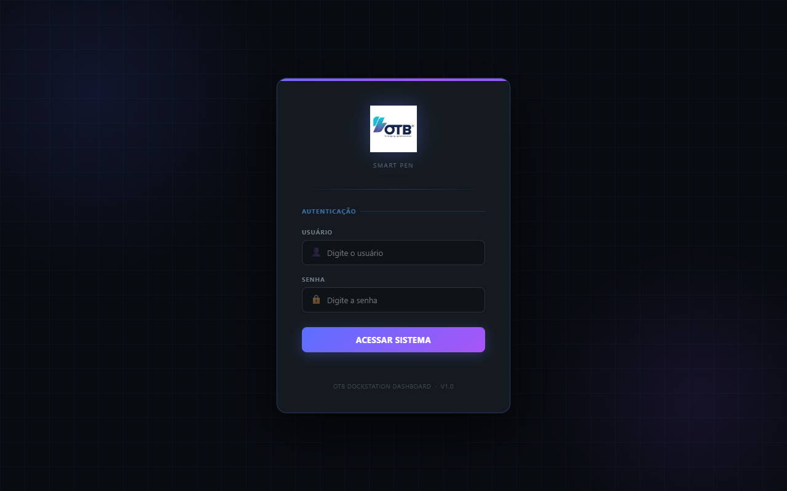

1. Insira seu **Usuário** (Padrão: `otb`).
2. Insira sua **Senha** (Padrão: `1234`).
3. Clique em **ACESSAR SISTEMA**.

> **IMPORTANTE:** O usuário e senha padrão (`otb` / `1234`) são apenas para o primeiro acesso. É **estritamente necessário** realizar a alteração dessas credenciais de acesso imediatamente após o procedimento de ativação da DockStation por questões de segurança corporativa.

### 2.2. Estabelecendo Conexão (Web Serial)
Na barra superior do Dashboard:
1. Certifique-se de que a placa ESP32 esteja conectada a uma porta USB do seu computador.
2. Clique no botão azul **Conectar** localizado no canto superior direito.
3. Uma janela nativa do navegador se abrirá. Selecione a porta serial correspondente à placa (ex: `COM3`, `COM4` ou `USB Serial Device`) e clique em **Conectar**.
4. O indicador (Status Pill) mudará de **Desconectado** (vermelho) para **Conectado** (verde).
5. Verifique se a caixa **"Auto-refresh"** (canto superior direito) está marcada. Ela garante a leitura em tempo real dos parâmetros vitais.

---

## 3. NAVEGAÇÃO E RECURSOS DO PAINEL

O menu lateral esquerdo (Sidebar) é subdividido em blocos operacionais:

### 3.1. Seção: Sistema
* **Overview:** Tela principal com medidores em ponteiro (gauges) do uso de memória, status e portas. 

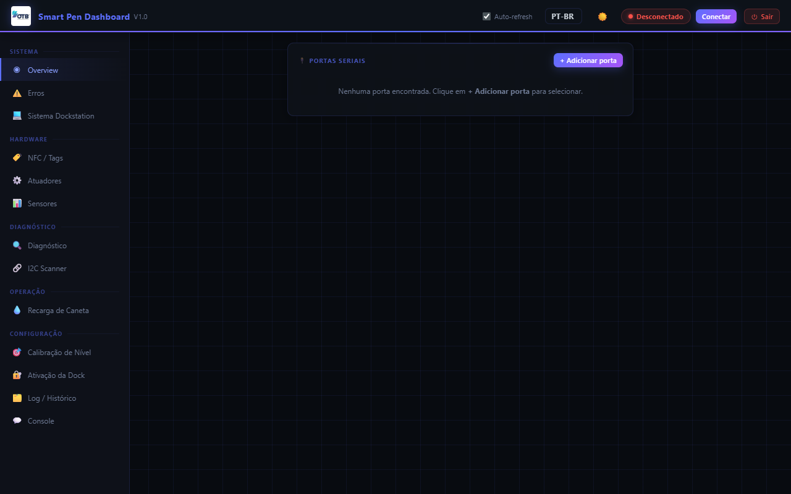

* **Erros:** Lista instantânea de falhas críticas. Qualquer erro não resolvido aparecerá como um "Badge" numérico na aba.

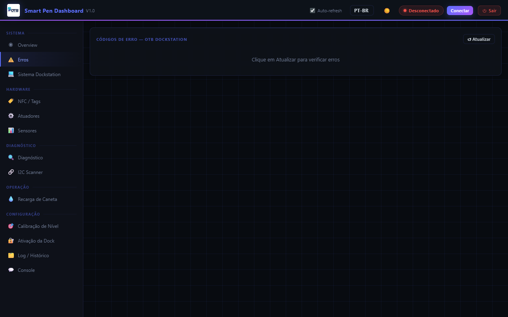

* **Sistema Dockstation:** Status geral do controlador embarcado e da memória NVS.

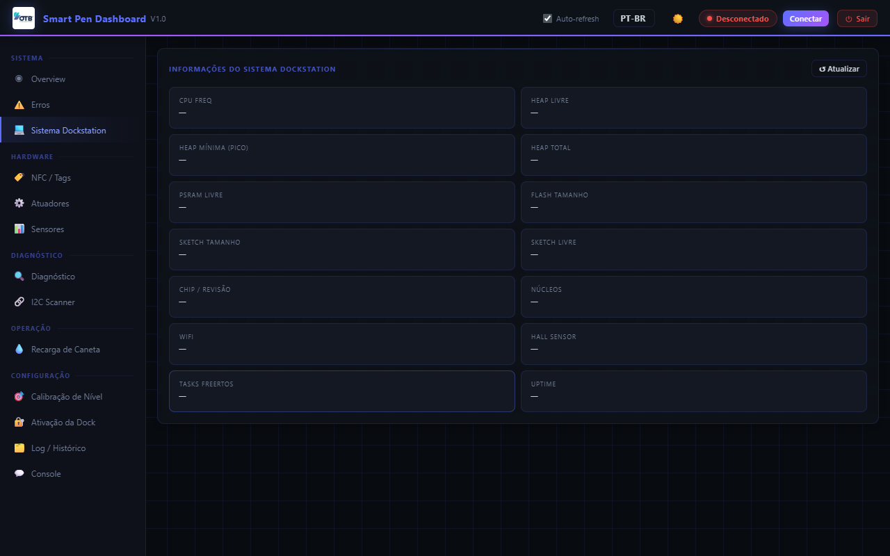

### 3.2. Seção: Hardware
* **NFC / Tags:** Controle dos 6 módulos leitores NFC (3 para canetas, 3 para cartuchos). Você pode ler o número de série, ID, status e número de ciclos da tag detectada.

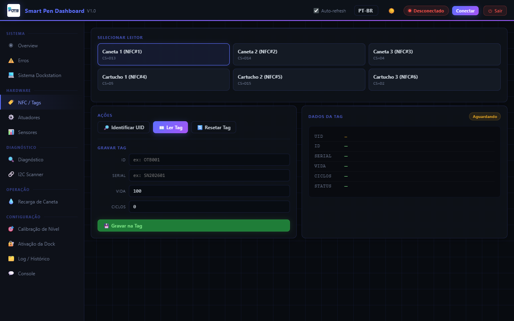

* **Atuadores:** Painel de controle direto. Permite ligar/desligar as Válvulas (1, 2 e 3) e testar a intensidade da Bomba (via barra deslizante PWM percentual).

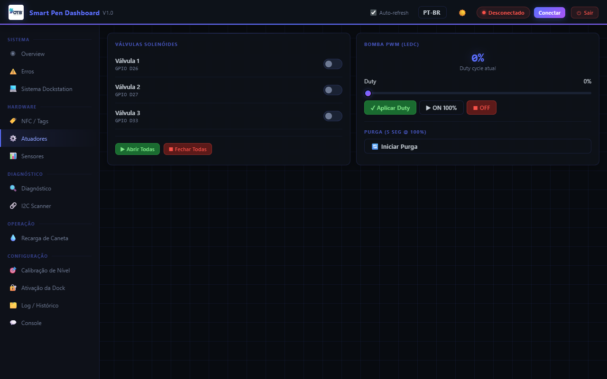

* **Sensores:** Visualização ao vivo do nível dos tanques (Canais CH0, CH1 e CH2 do chip FDC1004). Mostra a leitura bruta (RAW) e a leitura capacitiva (pF).

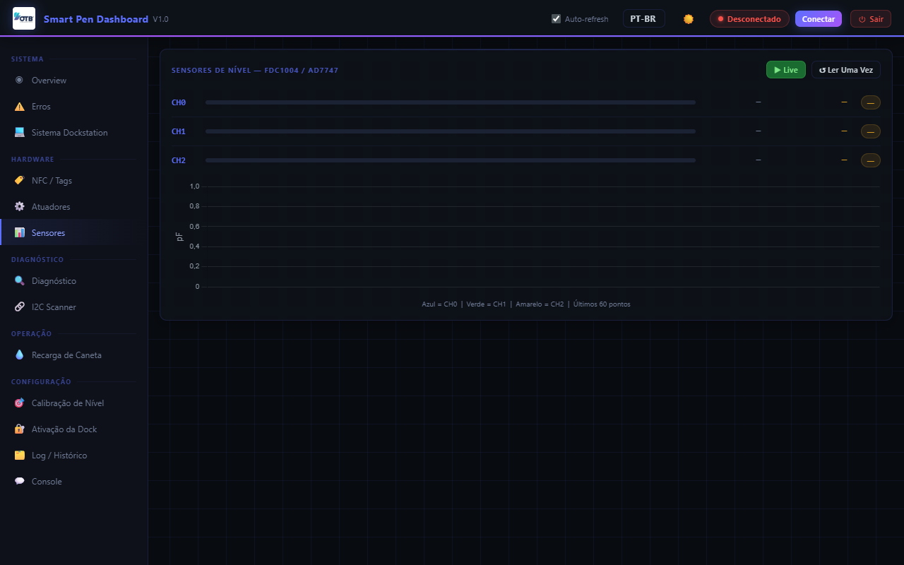

### 3.3. Seção: Diagnóstico
* **Diagnóstico:** Executa rotinas de autoteste para assegurar que atuadores e memórias estão operando nas faixas corretas.

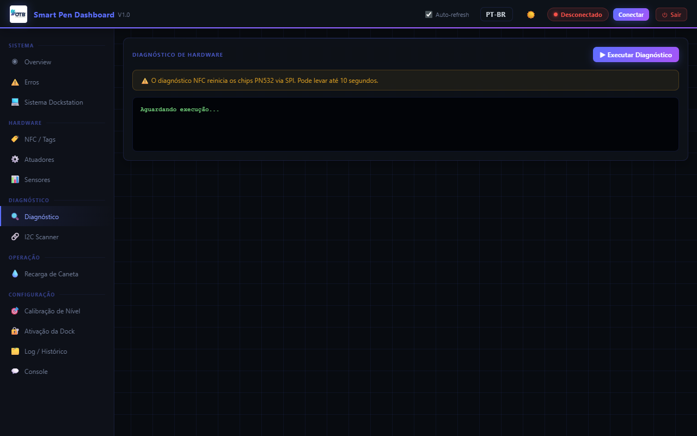

* **I2C Scanner:** Ferramenta avançada para buscar dispositivos de hardware no barramento I2C, garantindo que o Multiplexador TCA9548A e os medidores capacitivos estão online.

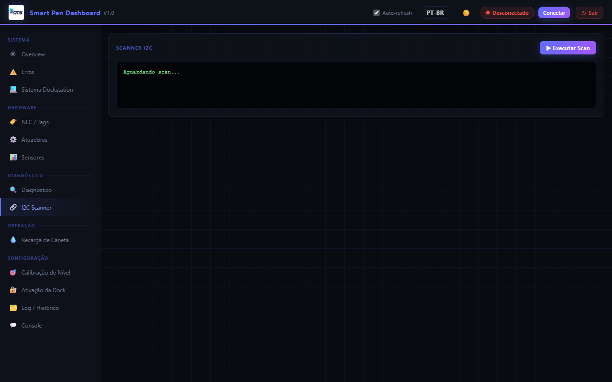

### 3.4. Seção: Operação
* **Recarga de Caneta:** Painel principal para o operador. Exibe medidores visuais de enchimento em tempo real (barras de percentual). Controla a bomba de injeção automática e indica a transição de estado da recarga (ex: *Running*, *Tapering*, *Done*, *Timeout*).

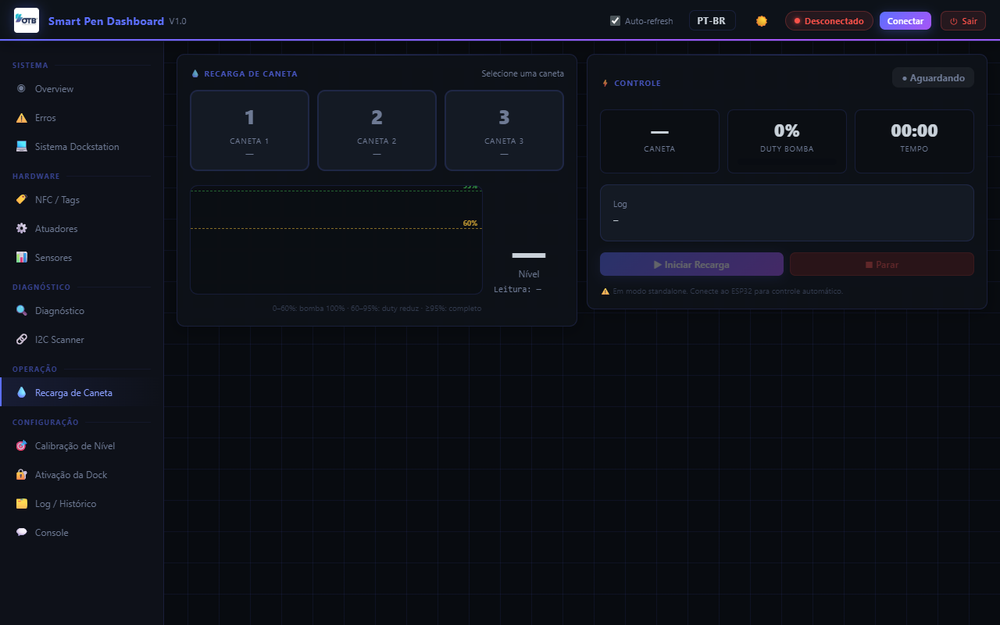

### 3.5. Seção: Configuração
* **Calibração de Nível:** Extremamente importante após montagem física. Define o valor "Bruto" que equivale a 0% (Vazio) e 100% (Cheio). A calibração refina a leitura e assegura a segurança anti-transbordamento.

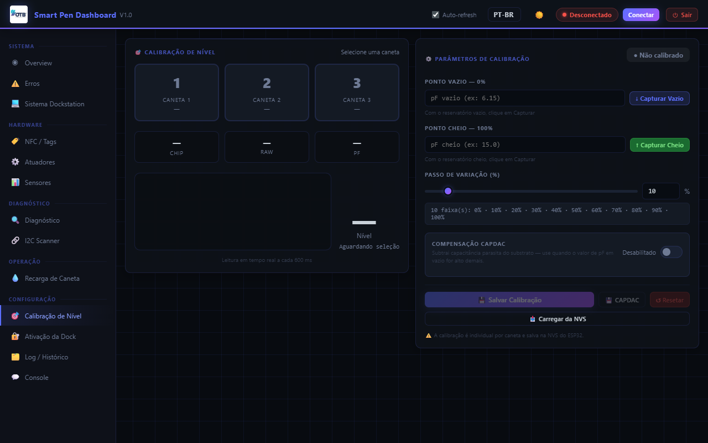
* **Ativação da Dock:** Painel para liberação via número de série da Dockstation, bloqueando uso não autorizado.

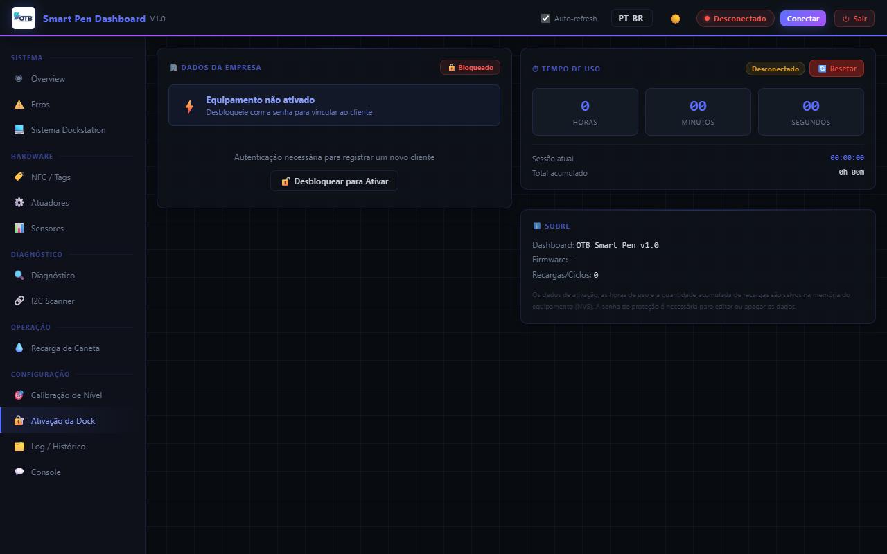

* **Log / Histórico:** Tabela que armazena os eventos do sistema, incluindo dados do sensor, data, hora e nível de gravidade (INFO, WARNING, ERROR, SUCCESS). 

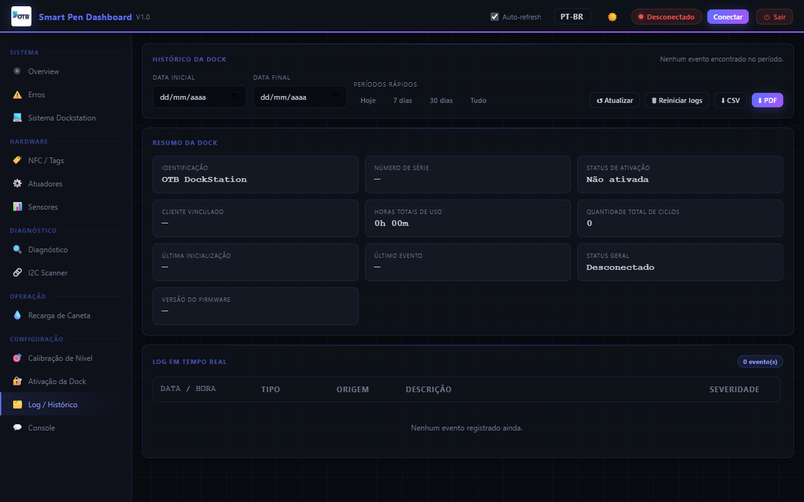

* **Console:** Interface de linha de comando (Serial Monitor). Permite enviar comandos texto de baixo nível à placa para testes profundos.

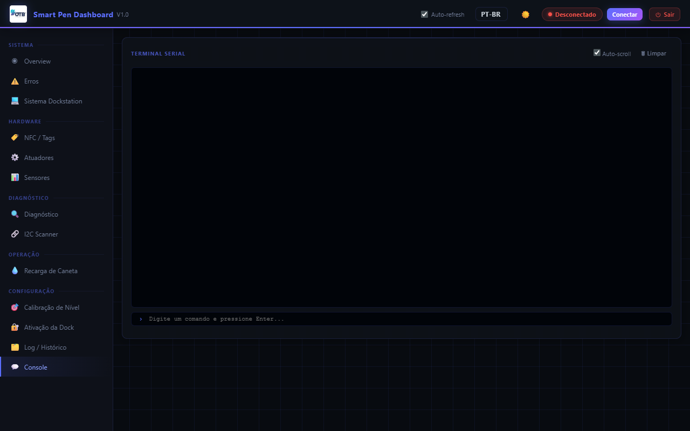

---

## 4. CÓDIGOS DE ERRO E RESOLUÇÃO

O sistema possui uma biblioteca de autodiagnóstico. Quando ocorrer uma falha, cruze o código (`E000`) com a tabela abaixo:

| Código | Módulo | Descrição do Evento |
|:---|:---|:---|
| **E001** | Sistema | Falha na inicialização do FreeRTOS (Sistema Travado). |
| **E002** | Sistema | Falha ao acessar memória NVS (Configurações Perdidas). |
| **E003** | Memória | Heap livre crítico - abaixo de 50KB. Risco de instabilidade. |
| **E004** | Sistema | Sistema reiniciado abruptamente pelo watchdog (WDT). |
| **E101** | NFC | Erro NFC Caneta 1 (Pino CS=D13). **Leitor Principal.** |
| **E102** | NFC | Erro NFC Caneta 2 (Pino CS=D14). |
| **E103** | NFC | Erro NFC Caneta 3 (Pino CS=D4). |
| **E104** | NFC | Erro NFC Cartucho 1 (Pino CS=D5). |
| **E105** | NFC | Erro NFC Cartucho 2 (Pino CS=D15). |
| **E106** | NFC | Erro NFC Cartucho 3 (Pino CS=D2). |
| **E110** | Tag | Falha de integridade na **leitura** de dados da tag NFC. |
| **E111** | Tag | Falha na **gravação** de dados na tag NFC encostada. |
| **E112** | Tag | A tag foi removida de modo irregular durante uma operação de escrita. |
| **E201** | I2C | MUX I2C TCA9548A ausente no barramento (End. 0x70 não responde). |
| **E211** | Sensor | Falha de leitura do Nível de Cartucho 1 (MUX CH0). |
| **E212** | Sensor | Falha de leitura do Nível de Cartucho 2 (MUX CH1). |
| **E213** | Sensor | Falha de leitura do Nível de Cartucho 3 (MUX CH2). |
| **E220** | Sensor | FDC1004 Timeout - Medição de capacitância não concluída a tempo. |
| **E221** | Sensor | FDC1004 Saturado - Eletrodo de leitura está fora da faixa de limite (Curto/Saturação). |
| **E222** | I2C | Barramento I2C travado, hardware forçou mecanismo de recuperação. |
| **E301** | Recarga | Timeout de Recarga: O nível ideal (80%) não foi atingido no limite de 60s. |
| **E302** | Atuador | **ALERTA GRAVE:** Bomba acionada sem nenhuma válvula estar aberta no caminho. |
| **E311** | Atuador | Válvula 1 retida aberta por mais de 5 minutos (Proteção ativada). |
| **E312** | Atuador | Válvula 2 retida aberta por mais de 5 minutos (Proteção ativada). |
| **E313** | Atuador | Válvula 3 retida aberta por mais de 5 minutos (Proteção ativada). |
| **E401** | Nextion | Display físico Nextion não está respondendo via Serial2 (UART). |
| **E402** | Nextion | O comando de navegação enviado ao Display Nextion foi rejeitado. |

> **DICA:**
> **Como Tratar um Erro:** Muitos erros se resolvem automaticamente quando a condição é normalizada (ex: repor uma caneta com mau contato NFC). Caso um erro crítico trave a placa, verifique a conexão serial ou utilize a aba **Console** para reiniciar a rotina específica.

---

## 5. RECOMENDAÇÕES DE USO DIÁRIO

1. **Ordem de Ligação:** Conecte o cabo de energia da DockStation primeiro. Espere 10 segundos, ligue o cabo USB no computador e em seguida clique em **Conectar** no Dashboard web.
2. **Ao encerrar o dia:** Garanta que todas as válvulas estejam desligadas (menu "Atuadores") e a bomba em `0%`.
3. **Calibração de Rotina:** Sempre que forem limpos os tubos ou alterados os parâmetros da tinta, refaça a operação de **Calibração de Nível**. Com o tanque vazio registre o valor RAW, depois repita a operação com o tanque em volume operacional cheio.
4. **Tags Travadas:** Caso a SmartPen acuse "Status=3 (Bloqueado)", utilize o painel NFC/Tags para resetar o status da memória NTAG para `OK`.

---

## 6. TERMOS DE GARANTIA E SUPORTE

1. **Cobertura Básica:** A DockStation OTB 1.0 possui garantia de 12 (doze) meses contra defeitos de fabricação em seus componentes eletrônicos (placa controladora, multiplexadores, leitores NFC e display Nextion) e mecânicos (bomba e válvulas).
2. **Exclusão de Garantia:** A garantia será anulada em caso de:
   - Uso de fluidos ou tintas não homologados pela OTB, causando entupimento ou corrosão na linha hidráulica.
   - Violação dos lacres de segurança físicos da DockStation.
   - Operação contínua da bomba com todas as válvulas fechadas, resultando na queima por sobrecarga do circuito (Erro E302).
   - Quedas, umidade extrema ou picos de tensão elétrica externa.
3. **Suporte Técnico:** Em caso de ocorrência de erros listados na Tabela de Códigos (Seção 4) que não puderem ser sanados localmente, acione o Suporte Técnico informando o código da falha e anexando os registros salvos na tela **"Log / Histórico"**.

---

## 7. ACORDO DE SIGILO E ACEITE CONTRATUAL

**CONFIDENCIALIDADE (NDA)**  
Este equipamento, incluindo seu firmware, dashboard web, código-fonte, diagrama elétrico e a totalidade das tecnologias integradas na **SmartPen DockStation OTB 1.0**, constitui propriedade intelectual confidencial exclusiva da OTB. É terminantemente proibida a cópia, engenharia reversa, descompilação, distribuição, modificação ou o compartilhamento das especificações técnicas com terceiros não autorizados sem o consentimento prévio e por escrito da OTB.

**TERMO DE ACEITE**  
Ao utilizar e operar o painel de configuração da DockStation OTB 1.0 pela primeira vez — fato comprovado pelo primeiro registro de ativação na aba de **Log / Histórico** e no banco de dados **NVS** —, o usuário e a empresa contratante declaram ter lido, compreendido e aceitado os presentes termos operacionais, de garantia e confidencialidade aplicados a este sistema. O descumprimento de qualquer uma das cláusulas acima ensejará a imediata revogação de acesso e a perda de todas as garantias associadas, sujeitando o infrator às medidas legais cabíveis.

---
**Fim do Documento**
